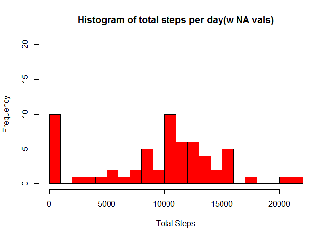
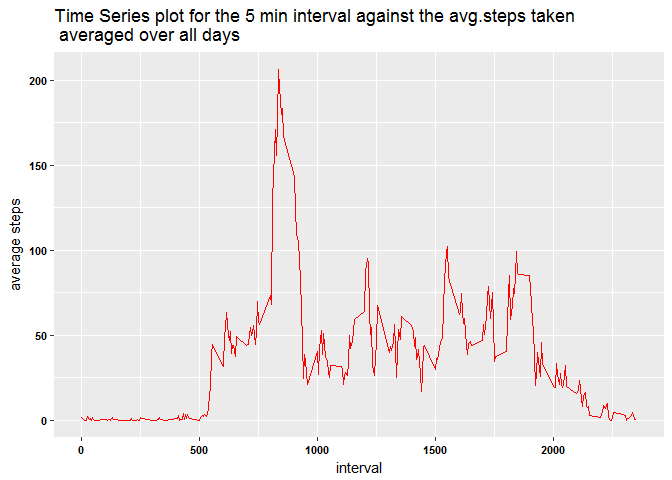
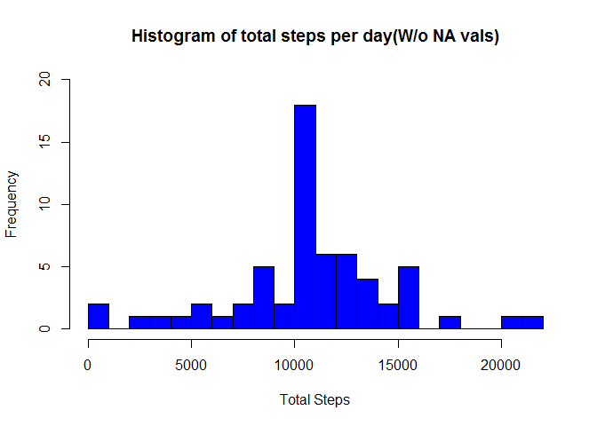
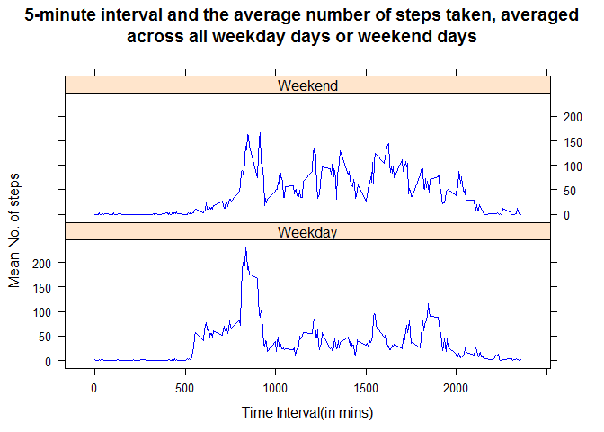

# Reproducible Research: Peer Assessment 1

```r
# Loading the required packages
library(ggplot2)
library(lattice)
library(plyr)
```
## Loading and preprocessing the data

```r
data1<-read.csv("activity.csv")
data1$date<-as.Date(data1$date)
summary(data1)
```

```
##      steps             date               interval     
##  Min.   :  0.00   Min.   :2012-10-01   Min.   :   0.0  
##  1st Qu.:  0.00   1st Qu.:2012-10-16   1st Qu.: 588.8  
##  Median :  0.00   Median :2012-10-31   Median :1177.5  
##  Mean   : 37.38   Mean   :2012-10-31   Mean   :1177.5  
##  3rd Qu.: 12.00   3rd Qu.:2012-11-15   3rd Qu.:1766.2  
##  Max.   :806.00   Max.   :2012-11-30   Max.   :2355.0  
##  NA's   :2304
```

## What is mean total number of steps taken per day?

1.Calculation of total number of steps per day. The code is shown as follows:


```r
steps_day<-aggregate(data1$steps,by=list(data1$date),FUN=sum,na.rm=TRUE)
colnames(steps_day)<-c("Date","Total.Steps")

steps_day$Date<-strptime(steps_day$Date,"%Y-%m-%d")
```

2.The histogram of the total number of steps taken each day is given as follows along with the code:


```r
hist(steps_day$Total.Steps,xlab = "Total Steps", ylab ="Frequency",col="red",
     main="Histogram of total steps per day(w NA vals)",breaks=20,ylim=c(0,20))
```

<!-- -->

3.The mean and median of the total number of steps perday are calculated as follows:


```r
mean_steps<-mean(steps_day$Total.Steps)
median_steps<-median(steps_day$Total.Steps)
```
#ANS
a.The mean:9354.2295082
b.The median:10395


## What is the average daily activity pattern?

1.The time series plot (i.e. type = "l") of the 5-minute interval (x-axis) and the average number of steps taken, averaged across all days (y-axis) is given as follows. The underlying code is also shown:


```r
steps_interval<-aggregate(data1$steps,by=list(data1$interval),FUN=mean,na.rm=TRUE)
colnames(steps_interval)<-c("interval","avg.steps")

g2<-ggplot(steps_interval,aes(interval,avg.steps))+geom_line(color="red")+
        ggtitle("Time Series plot for the 5 min interval against the avg.steps taken \n averaged over all days")+
        theme(axis.text = element_text(size=8,face="bold",color="black"))+
        xlab("interval")+ylab("average steps")
print(g2)
```

<!-- -->

2.The 5 min interval accross all days that is the highest is calculated as follows:


```r
max_int<-steps_interval$interval[which(steps_interval$avg.steps==
                                               max(steps_interval$avg.steps))]
```
#ANS
Interval having max number of steps: 835

## Imputing missing values

1. The number of total missing values in the data set is given by the following calculation

```r
missing<-sum(rowSums(is.na(data1)))
```
Thus, the total number of missing values in the data set is 2304

2. and 3.  The strategy for filling in all the missing values in the data set is to fill in the NA values with the mean of that particular 5 minute interval.Hence the steps would be:

a. To calculate the mean of the steps by interval.
b. Find out the intervals corresponding to the missing values in steps.
c. Run a nested for loop which assigns the mean of the steps for a particular 5 minute interval.
The code is given as follows

```r
ab<-which(is.na(data1$steps))
int<-data1$interval[ab]
datanew<-data1
datanew$date<-as.Date(datanew$date)

for (i in ab){
        
        for (j in 1:length(unique(data1$interval))){
                
                
                if (datanew$interval[i]== steps_interval$interval[j]){
                        datanew$steps[i]<-steps_interval$avg.steps[j]}
        }
}
```


4.The new histogram for the total number of steps is as follows:


```r
steps_day_new<-aggregate(datanew$steps,by=list(datanew$date),FUN=sum,na.rm=TRUE)
colnames(steps_day_new)<-c("Date","Total.Steps")

hist(steps_day_new$Total.Steps,xlab = "Total Steps", ylab ="Frequency",col="blue",
     main="Histogram of total steps per day(W/o NA vals)",breaks=20,ylim=c(0,20))
```

<!-- -->

5. Calculating the mean and median of steps of new data is given by the following 
calculation


```r
mean_steps_new<-mean(steps_day_new$Total.Steps)
median_steps_new<-median(steps_day_new$Total.Steps)
```
#ANS
a.The mean : 1.0766189\times 10^{4}
b.The median : 1.0766189\times 10^{4}
The mean for the Non NA set is higher than the median for the NA set by 15.0943396%..

The median for the non NA set is higher than that of the Na set by 
3.5708387%..

## Are there differences in activity patterns between weekdays and weekends?

1. The factor variable in the data set with two levels viz weekdays and 
weekends is introduced in the following manner:


```r
datanew$day<-weekdays(datanew$date)

datanew$day.type<-ifelse(datanew$day == "Saturday" | datanew$day == 
                                 "Sunday", "Weekend", "Weekday")

nframe<-ddply(datanew,.(interval,day.type),summarise,mean=mean(steps))
colnames(nframe)<-c("interval","day.type","mean.steps")
```

2. Panel plot containing a time series plot (i.e. type = "l") of the 5-minute 
interval and the average number of steps taken, averaged across all weekday 
days or weekend days is shown as follows:


```r
xyplot(mean.steps~interval|day.type, data=nframe,type="l",col="blue",
       layout=c(1,2),ylab="Mean No. of steps",xlab="Time Interval(in mins)",
main=" 5-minute interval and the average number of steps taken, averaged 
across all weekday days or weekend days")
```

<!-- -->
